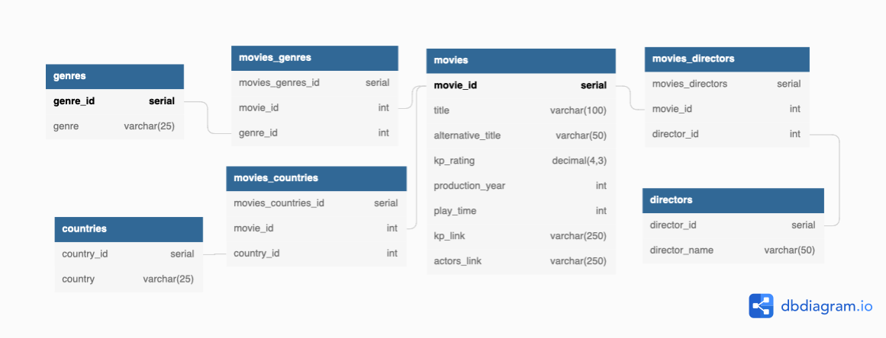

# Парсер сайта Kinopoisk.ru
## Описание проекта
Проект реализует следующий функционал:
- Парсинг фильмов с сайта "Kinopoisk.ru" с возможностью задать диапазон выхода фильмов по годам. Парсит следующие данные: заголовок, альтернативный заголовок, рейтинг сайта, год выхода в прокат, длительность в минутах, режиссёр, страна производитель, жанры, ссылка на страницу фильма, ссылка на страницу с актерами. 
- Создание таблиц базы данных
- Запись информации в базу данных
- Ведение логов записи данных и возникающих ошибок
- При Возникновении ошибок записывает год и страницу остановки. При следующем старте, продолжает парсинг с сохраненной точки.

## План развития проекта
 - Покрытие кода тестами
 - Отправка логов в бота телеграмм 
 - Запуск парсера из бота телеграмм
 - Парсинг актеров с расширением существующей базы

## Структура базы данных
База данных состоит из 7 таблиц:


- movies
```
movie_id serial primary key,
title varchar(200) not null,       # заголовок фильма
alternative_title varchar(200),    # альтернативный заголовок
kp_rating decimal(4,3),            # рейтинк сайта кинопоиск
production_year int,               # год выхода
play_time int,                     # длительность в минутах
kp_link varchar(250),              # ссылка на страницу фильма
actors_link varchar(250)           # ссылка на страницу с актерами 
```
- genres
```
genre_id serial primary key,
genre varchar(25) unique          # жанр фильма
```
- countries
```
country_id serial primary key,
country varchar(25) unique       # страна производства фильма
```
- directors
```
director_id serial primary key,
director_name varchar(50) unique # режисер снявший фильм
```
- movies_genres
```
movies_genres_id serial primary key,
movie_id int not null,
genre_id int not null,
foreign key (movie_id) references movies(movie_id),
foreign key (genre_id) references genres(genre_id)
```
- movies_countries
```
movies_countries_id serial primary key,
movie_id int not null,
country_id int not null,
foreign key (movie_id) references movies(movie_id),
foreign key (country_id) references countries(country_id)
```
- movies_directors
```
movies_directors_id serial primary key,
movie_id int not null,
director_id int not null,
foreign key (movie_id) references movies(movie_id),
foreign key (director_id) references directors(director_id)
```


## Технологии
- python 3.9 - язык программирования, на котором написан парсер.
- psycopg2 2.9.3 - библиотека для работы с базой данных PostgreSQl
- logging - встроенная библиотека для логирования 
- requests - библиотека для работы с запросами
- PostgreSQl 13 - база данных проекта

## Запуск проекта
Скачать проект, в корне проекта создать виртуальное окружение
```
python3 -m venv venv
```
Активировать виртуально окружение
```
source venv/bin/activate
```
Установить зависимости из файла requirements.txt
```
pip install -r requirements.txt. 
```
Создать базу данных PostgreSQL. Записать в файл .env (находится в коре проекта) данные для подключение к базе данных
```
DB_NAME=      # имя базы данных
DB_USERNAME=  # имя пользователя базы данных
DB_PASSWORD=  # пароль от базы данных 
DB_HOST=      # хост
```
Создать таблицы в базе данных запустив файл 
```
create_table.py
```
В файле settings.py установить настройки парсинга
```
MOVIES_PER_PAGE = 100       # количество фильмов на странице
DEFAULT_START_YEAR = 2021   # год начала парсинга
DEFAULT_FINISH_YEAR = 2020  # год окончания парсинга
DEFAULT_START_PAGE = 1      # стартовая страница 
SLEEP = 8                   # задержка между запросами страниц (в секундах)
```
Запуск парсера происходит из файла main(). При возникновении ошибок, последний год и страница не сохраненных данных записываются в файл last_parsed_state.txt. При следующем старте, парсер возьмет год и страницу из этого файла затем очистит его. Если после возникновения ошибки требуется запустить парсер с настройками из файла settings.py, нужно очистить файл last_parsed_state.txt вручную.

